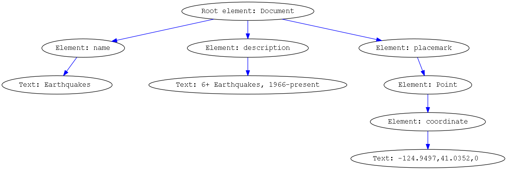

<!-- Don't edit in between this line and the one below -->
```{r include=FALSE}
# Don't delete this chunk if you are using the DataComputing package
library(DataComputing)
library(XML)
```
*Source file* 
```{r, results='asis', echo=FALSE}
includeSourceDocuments()
```
<!-- Don't edit the material above this line -->
```{r}
# read file
table <- read.csv("NCEDC3+quakes.csv")
```


```{r}
# create vector
table_cleaned <- table %>% filter(Magnitude >= 4)
longitude <- table_cleaned$Longitude
latitude <- table_cleaned$Latitude
```

```{r}
datetime <- as.character(table_cleaned$DateTime) 
datetimefix <- gsub("/", "-", datetime)
datetimefix <- gsub(" ", "T", datetimefix)
datetimefix <- paste(datetimefix, "Z", sep = "")
```

```{r}
doc <- newXMLDoc()  
root <- newXMLNode("kml",namespaceDefinitions = "http://www.opengis.net/kml/2.2", doc = doc)
document <- newXMLNode("Document", parent = root)   
name <- newXMLNode("name", "Earthquakes", parent = document)
description <- newXMLNode("description","4+ Earthquakes, 1966-present", parent = document)
```

```{r}
for (i in 1:length(latitude)) {
  location <- paste(as.character(longitude[i]), sep = ", ", as.character(latitude[i]))
  stamp <- paste(datetimefix[i], "Z", sep = "")
  placemark <- newXMLNode("Placemark", parent = document)
  point <- newXMLNode("Point", parent = placemark)
  coordinates <- newXMLNode("coordinates", location, parent = point)
  tstp <- newXMLNode("TimeStamp", parent = placemark)
  when <- newXMLNode("when", stamp, parent = tstp)
}
saveXML(doc, file = "assignment10.kml")

```

Picture drawn is here

```{}
//code for .dot file it is a C++ extension for generating diagrams
digraph hw10 {

    nodesep=1.0; // increases the separation between nodes
//    rankdir = "LR";
    node [fontname=Courier] //All nodes will this shape and colour
    edge [color=Blue, fontsize = 40] //All the lines look like this


    rt [label = "Root element: Document"]
    lv1_1 [label = "Element: name"]
    lv1_2 [label = "Element: description"]
    lv1_3 [label = "Element: placemark"]

    lv2_1 [label = "Element: Point"]
    lv2_2 [label = "Text: Earthquakes "]
    lv2_3 [label = "Text: 6+ Earthquakes, 1966-present"]

    lv3_1 [label = "Element: coordinate"]
    lv4_1 [label = "Text: -124.9497,41.0352,0 "]

    rt -> {lv1_1, lv1_2, lv1_3}

    lv1_1 -> {lv2_2};
    lv1_2 -> {lv2_3};
    lv1_3 -> {lv2_1};
    lv2_1 -> {lv3_1};
    lv3_1 -> {lv4_1};
}

```
